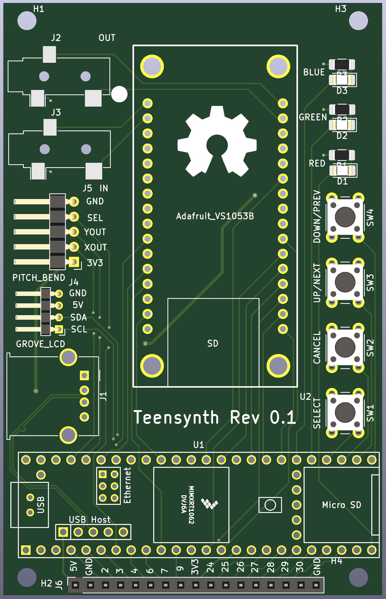

# Teensynth

The aim of the project is to create a companion board for MIDI compatible keyboards / electric pianos and augment them with commonly used / needed features such as:

* Midi recording: Sample and forward USB Midi signal and forward it to the host machine (or record in an SD card).
* Audio recording: Record Line out / Headphone out (for now only the latter is implemented) and stream it to the host through an Audio USB device interface.
* Midi synthesizer: Read MIDI files from SD card or receive MIDI commands from USB interface and synthesize them, as well as mix them with the audio signal (i.e. create a midi base and jam on it!)
* Implement pitch bend: For keyboards that support pitch bend MIDI commands but don't have a pitch wheel, create one with a joystick / potentiometer.

The board aims to be used in two ways:

### Standalone mode

All the recording outputs are to SD card, all the inputs (i.e. MIDI) are from SD card or firmware, control is done through hardware buttons and feedback to the user is through the Grove compatible I2C LCD display. 

### USB device mode

The device implements bidirectional MIDI (send the keyboard output to the host machine / synthesize the host machine's output) and Audio streaming to the host machine.
Streaming audio from the host machine to the onboard DAC should also be possible but is not a priority right now.

# Hardware

The hardware has been designed with kicad, it is a carrier board for  Teensy 4.1 and the Adafruit VS1053B breakout board.

# Firmware

The firmware has been developed with the Arduino / Teensyduino IDE, using external libraries (such as Adafruit VS1053B library) when necessary.
